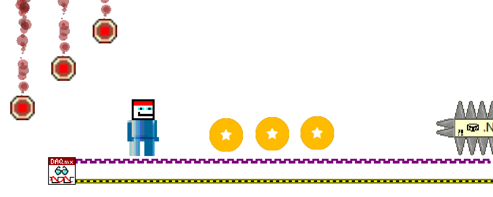

## Welcome to WalKING The Wires
WalKING The Wires is a LabVIEW-Themed jump & run game. You can explore four different blockdiagrams and collect kudos to reach the highscore!

### About this game
This game is developed for LabVIEW Enthusiasts but is fun to play for anyone. It's a pure hobby project created without any gamedevelopment background.

<table>
    <tr>
        <td></td>
        <td></td>
    </tr>
    <tr>
        <td></td>
        <td></td>
    </tr>
</table>

Feedback and bugreports are very welcome: [calmy.jane@gmail.com](mailto:calmy.jane@gmail.com)

### Instructions
**Unpack the complete content** of the zip and run *Walking The Wires.exe*.
Move with WASD or Arrow Keys. Play the tutorial and read the help for details. 

### Disclaimer
This software is privatly developed and is in no connection to National Instruments. Feel free to privately use and share this software. For commercial use (e.g. tradeshows), please contact [calmy.jane@gmail.com](mailto:calmy.jane@gmail.com).

## Have Fun Playing!
